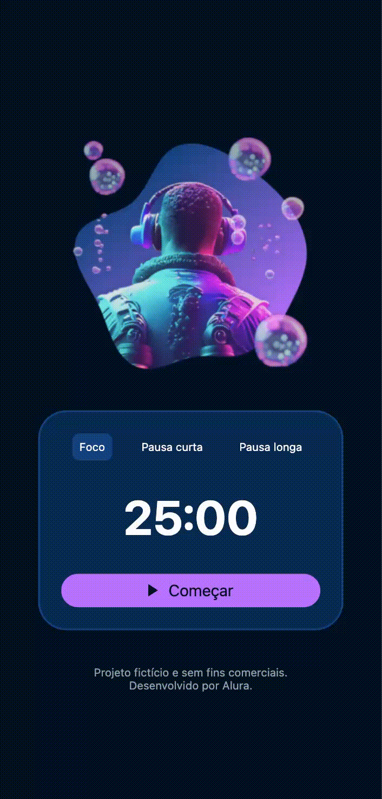

# 📱 Fokus

O **Fokus** é um aplicativo mobile de produtividade desenvolvido em React Native utilizando Expo. Ele ajuda o usuário a focar nas tarefas através de ciclos de tempo (Técnica Pomodoro), oferecendo modos de Foco, Pausa Curta e Pausa Longa com uma interface intuitiva.

---

## ✨ Demonstração




---

## 🚀 Tecnologias utilizadas

-   [React Native](https://reactnative.dev/)
-   [Expo](https://expo.dev/)
-   [Expo Router](https://docs.expo.dev/router/introduction/) (para navegação)
-   [React Native SVG](https://github.com/react-native-svg/react-native-svg) (para ícones customizados)

*(O projeto possui configuração para TypeScript, mas os componentes principais estão em JavaScript)*

---

## 📁 Estrutura do Projeto

O projeto está organizado da seguinte forma:

-   `app/`: Contém a tela principal (`index.jsx`) e as imagens de fundo para cada modo do timer (`long.png`, `pomodoro.png`, `short.png`).
-   `assets/`: Inclui fontes (`fonts/`) e imagens (`images/`) globais como ícones e logos.
-   `components/`: Abriga os componentes reutilizáveis da interface do usuário como botões (`ActionButton`, `FokusButton`), ícones SVG (`Icons`) e o display do timer (`Timer`).

---

## ⚙️ Instalação e execução

### 🔧 Pré-requisitos

Antes de começar, você precisa ter instalado:
-   [Node.js](https://nodejs.org/)
-   [Git](https://git-scm.com/)
-   [Expo CLI](https://docs.expo.dev/get-started/installation/)

---

### 📥 Clonar o repositório

```bash
git clone [https://github.com/seuusuario/fokus-completo.git](https://github.com/seuusuario/fokus-completo.git)
cd fokus-completo


npm install
# ou
yarn install


# Iniciar o servidor de desenvolvimento Expo
npm start
# ou
yarn start

# Iniciar no Android (requer emulador ou dispositivo conectado)
npm run android
# ou
yarn android

# Iniciar no iOS (requer simulador ou dispositivo conectado - macOS necessário)
npm run ios
# ou
yarn ios

# Iniciar no Navegador Web
npm run web
# ou
yarn web
